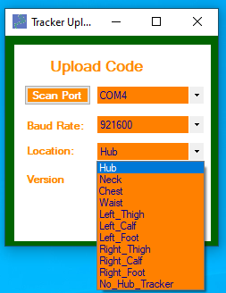
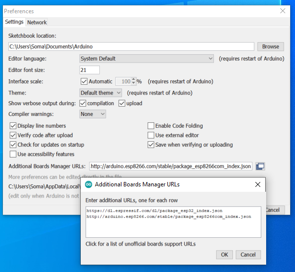
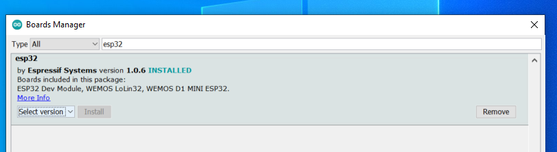
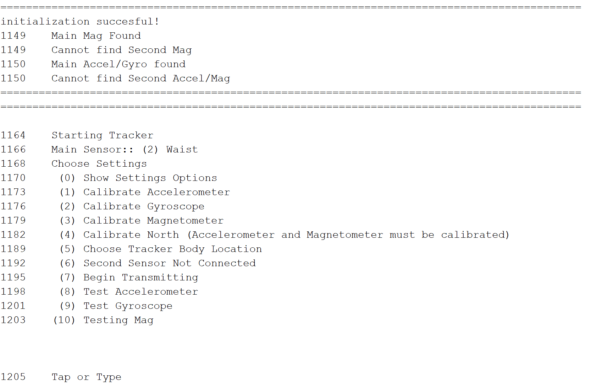

# SomaSensorsVR_Tracker_Uploader
Upload the tracking software to the ESP32 boards (both hub and tracker)

This software is currently only for ESP32 boards and MPU9250 IMUs.

# Tracker Uploader GUI


To use this program, you will need to download the Arduino IDE : https://www.arduino.cc/en/software
Once you have it downloaded, open up a blank project.
Go to File > Preferences


# Additional Board Manager URLs
Click on the textbox for "Additional Board Manager URLs:" and add the following line:

https://dl.espressif.com/dl/package_esp32_index.json
http://arduino.esp8266.com/stable/package_esp8266com_index.json
This will allow you to download the ESP32 board mangager.
Click OK.

# Add ESP32 Board Manager

Next, in the arduino IDE Go to
Tools > Board > Board Manager
Search "esp32" and download the esp32 by Espressif Systems version 1.0.6
Click Close.

Once that is installed, you should be able to use the Uploader!

Open the Uploader, plug in your hub or tracker
Scan for the comPort and select the correct one
select your location or hub
Upload

To manually run the script from a Command Prompt:
```
C:\Users\USER_NAME\AppData\Local\Arduino15\packages\esp32\tools\esptool_py\3.0.0/esptool.exe --chip esp32 --port COM4 --baud 921600 --before default_reset --after hard_reset write_flash -z --flash_mode dio --flash_freq 80m --flash_size detect 0xe000 C:\Users\USER_NAME\AppData\Local\Arduino15\packages\esp32\hardware\esp32\1.0.6/tools/partitions/boot_app0.bin 0x1000 C:\Users\USER_NAME\AppData\Local\Arduino15\packages\esp32\hardware\esp32\1.0.6/tools/sdk/bin/bootloader_qio_80m.bin 0x10000 C:\Users\USER_NAME\Desktop\SomaStuff\SomaSensorsVR_Tracker_Uploader-main\Uploader_For_Tracker_v0.1\Hub_Version\1.8/Hub.ino.bin 0x8000 C:\Users\<USER_NAME>\Desktop\SomaStuff\SomaSensorsVR_Tracker_Uploader-main\Uploader_For_Tracker_v0.1\Hub_Version\1.8/Hub.ino.partitions.bin
```
Replace USER_NAME with your user name

Replace COM4 with whichever com port your tracker is connected to
  
Replace `C:\Users\<USER_NAME>\Desktop\SomaStuff\SomaSensorsVR_Tracker_Uploader-main\Uploader_For_Tracker_v0.1\Hub_Version\1.8` with whatever directory you saved the uploader folder to.

## Tracker Version 1.7.2+
As of version 1.7.2 there will be a Serial Menu for each tracker.
- Simply plug the tracker into your computer
- Open Arduino IDE
- Open Serial Monitor
- Set Baudrate to 115200
- Press the EN button on the sensor to restart and show the menu.



# Manual Command Code
As of Tracker_Uploader_v0.6 there will be a 'manual command code' text box at the bottom.
After scanning and hitting the "Upload" button, if the uploader is failing to upload the firmware correctly, you should be able to open up a command prompt and copy/paste the line of code into it to upload it manually.
1) start menu > search > "command prompt"
2) copy the command line from the "Manual Command Code" and hit enter
3) When you see "....____....____...." hold down the "boot" button on your esp32 or tracker
4) ??????
5) profit
